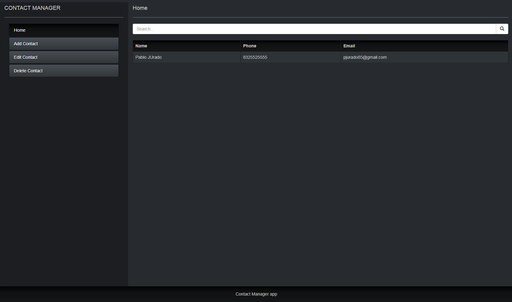

# Contact Manager App

> This is a Vanilla JavaScript Single Page App that allow you to store your friends contact information.

With the Contact Manager App you are able to store each person's name, phone number, and email address. The contact information is stored in browser local storage. That way, the contact information will not disappear when you shutdown your computer. The App include a Search box on the Home page that enables you to search for contacts by name.

Use Bootstrap to style the Contact Manager App. In particular, use Bootstrap to style all tables, buttons, and forms.

## Tech/framework used
Built with:
* Bootstrap
* Vanilla JavaScript
* Local Storage

## Credits
[Pablo Jurado](https://github.com/pablo-jurado).
